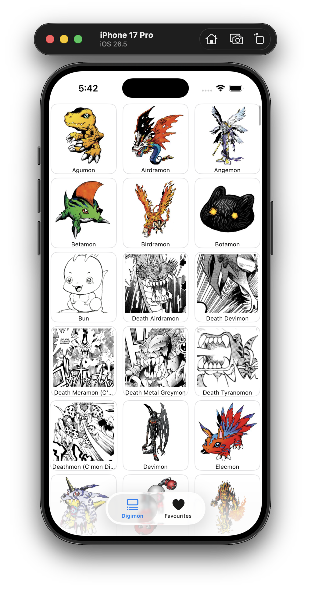
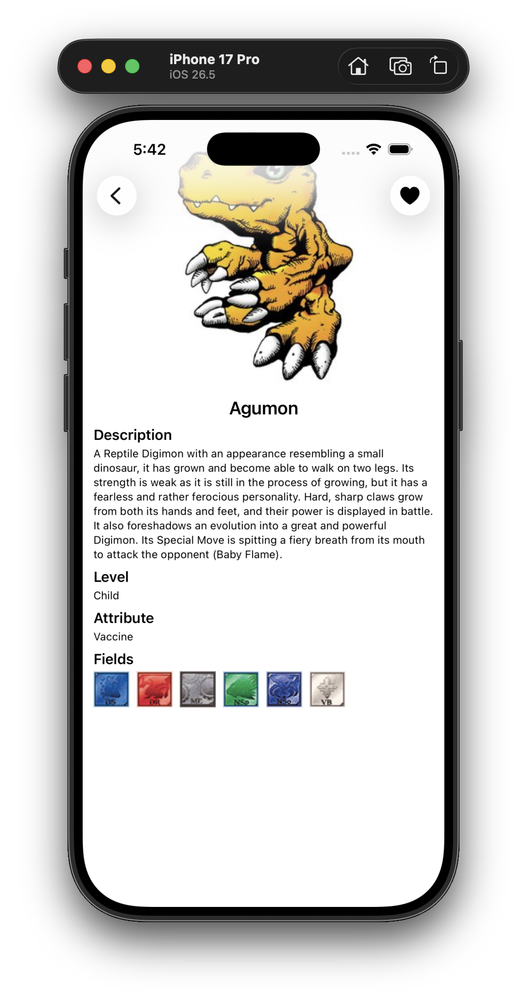
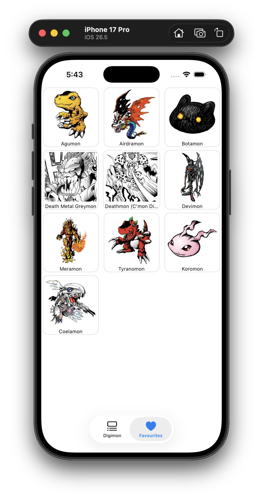

# DigiDex

<p align="center">
  
  
  
</p>

A Digimon encyclopedia app for iOS built with SwiftUI. Browse the full Digimon database in a paginated grid, inspect each Digimon's details (description, level, attribute, fields, and more), and save your favourites locally.

Created by **Hamam Nasrodin**.

---

## ✨ Features

- **Digimon Directory** — Scrollable 3‑column grid of Digimon with infinite scroll (pagination, 21 items per page).
- **Detail View** — Full profile for each Digimon: image, description, evolution level, attribute, and fields.
- **Favourites** — Heart any Digimon to save it locally; view your saved collection in the Favourites tab.
- **Local Persistence** — Favourites are stored on-device with SwiftData and survive app restarts.
- **Async Images** — Images are loaded asynchronously with built-in progress placeholders.

## 🧱 Tech Stack & Libraries

| Library                                                          | Purpose                                              |
| :--------------------------------------------------------------- | :--------------------------------------------------- |
| [SwiftUI](https://developer.apple.com/xcode/swiftui/)            | Declarative UI framework                             |
| [SwiftData](https://developer.apple.com/documentation/swiftdata) | On-device persistence for favourites                 |
| [Alamofire](https://github.com/Alamofire/Alamofire) (v5.12.0)    | Networking / API requests, via Swift Package Manager |
| [Digi-API](https://digi-api.com)                                 | Public REST API for Digimon data                     |

## 🚀 Setup

### Requirements

- **Xcode 15+** (SwiftData requires iOS 17+)
- **iOS 17.0+** simulator or device
- macOS with Xcode installed

### Steps

1. **Clone the repository**

   ```bash
   git clone <your-repo-url>
   cd DigiDex
   ```

2. **Open the project in Xcode**

   ```bash
   open DigiDex.xcodeproj
   ```

3. **Resolve dependencies** — Alamofire is fetched automatically via Swift Package Manager on first build. (Project → _Package Dependencies_ should show `Alamofire 5.12.0`.)

4. **Select a simulator / device** with iOS 17.0 or later.

5. **Build & run**
   - Press `⌘R`, or
   - Product ▸ Run from the menu bar.

> **Note:** No API key is required — the app uses the public [Digi-API](https://digi-api.com). A working internet connection is needed to load the Digimon list and images.

## 🗂 Project Structure

```
DigiDex/
├── DigiDexApp.swift              # App entry, SwiftData model container setup
├── ContentView.swift             # Root tab view (Digimon / Favourites)
├── DigimonListView.swift         # Paginated grid of Digimon
├── DigimonDetailView.swift       # Digimon detail + favourite toggle
├── DigimonListFavouriteView.swift# Favourites grid (SwiftData-backed)
├── models/
│   ├── DigimonFavouriteModel.swift  # SwiftData @Model for favourites
│   └── LabelValue.swift
├── services/
│   └── DigimonService.swift      # API layer (list + detail endpoints)
├── Assets.xcassets/
└── screenshots/                  # README screenshots
```

## 🗺 Data Source

The app consumes the public **[Digi-API](https://digi-api.com)**:

- `GET https://digi-api.com/api/v1/digimon?page={page}&pageSize=21` — paginated list
- `GET https://digi-api.com/api/v1/digimon/{id}` — single Digimon detail

## 📄 License

This project is for learning purposes. Digimon characters and images are © their respective owners.
